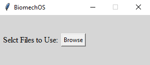
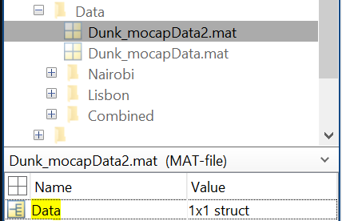
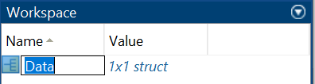
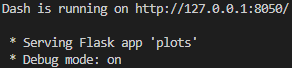
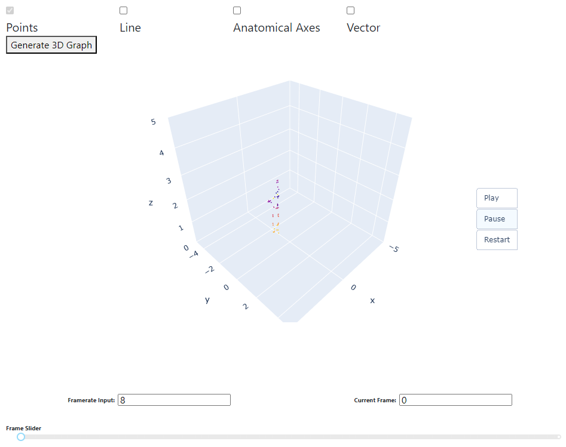
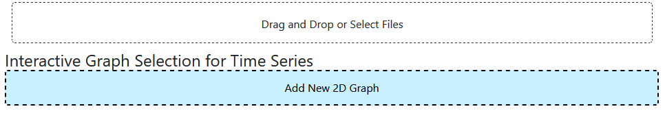
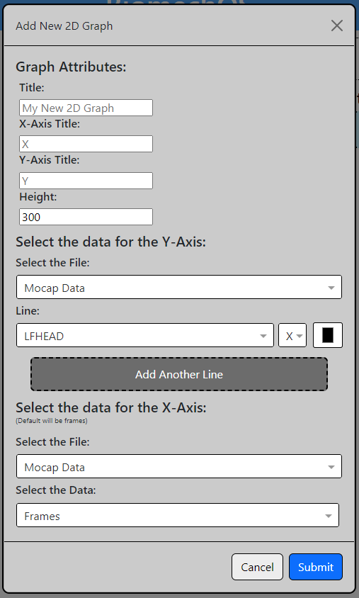

# BiomechVis

Biomechanics is a relatively newer field of research, and there is not a lot of software infrastructure that allows researchers to interact with 3D motion capture data. Free and open-source visualization software options are rare and limited. With BiomechVis we hope to offer accessible data visualization tools for biomechanical research. BiomechVis is capable of receiving processed data in the form of .mat files, creating 2D time series graphs, and generating 3D and 2D visualizations using point and line graphs. This system allows researchers to better view and interact with their data to deepen their analyses.

## Table of Contents

-   [Installation](#installation)
-   [Initalizing](#initalizing)
-   [Importing Data](#importing-data)
    * [Points](#points)
    * [Vectors](#vectors)
    * [Anatomical Axis](#anatomical-axis)
    * [Segment Center of Mass](#segment-center-of-mass)
    * [Total Body Center of Mass](#total-body-center-of-mass)
-   [Viewing and Controling the Visualization](#viewing-and-controling-the-visualization)
    * [3D Visualizer](#3d-visualizer)
    * [2D Visualizer](#2d-visualizer)
        - [Drag and Drop or Select Files Box](#drag-and-drop-or-select-files-box)
        - [Interactive Graph Selection for Time Series](#interactive-graph-selection-for-time-series)
    * [Running Multiple Trials at Once](#running-multiple-trials-at-once)
-   [Contributing](#contributing)

## Installation

Installation can be performed with the requirements.txt file included in the project. Install dependencies with the following command in terminal:

```bash
pip install -r requirements.txt
```

## Initalizing

After installing the necessary dependencies, execute the program:

```
python plotDash.py
```

Note: Please ensure the terminal is currently set to the directory that contains the python script.  To do so, run cd "path to folder" ex: cd C:\Users\Name\Documents\BiomechVis

From here, you can select mat files to import into the project using the file selector.

Both 3D and 2D graphs can then be manipulated to analyze data.

## Importing Data

Upon running, the following window will appear.



Select Browse.  There are five mat files needed to run the program. Each mat file corresponds to one of the following: Points, Vectors, Anatomical Axis, Segment Center of Mass and Total Body Center of Mass.  At least points need to be put in for the visualizations to work, this is a plotly limitation.

The following sections describe the way each data type must be passed.

- ### Points

    Points are a list of dictonaries.  Each key is the point name and the value is an N x 3 matrix.  The three columns represent the X, Y and Z positive respecitively.  The row index represents the timestep for that point location

- ### Vectors

    IMPORTANT NOTE: Currently only one vector, name "TBCMVeloc" is supported.  This represents the Total Body Center of Mass Velocity vector

- ### Anatomical Axis

    Anatomical Axis is a list of dictonaries. The key is the Segment Center of Mass name to conenct the axis to.  The value is 3x3xN where the top N is the frame the axis comes from, the first nest is the three axis (x-axis, y-axis, z-axis) and the last nest is the location of the end point of the axis (x, y, z).  In the final graph, the x-axis is drawn red, the y-axis is drawn green and the z-axis is drawn blue for RGB.

- ### Segment Center of Mass

    Segment Center of Mass is a list of dictonaries.  Each key is the name of the segment.  Each value is a N x 3 matrix in the same form as all [points](#points).

- ### Total Body Center of Mass

    A single N x 3 matrix representing the total body center of mass.  The matrix is represented the same way as all [points](#points).

- #### Issues with Data importing:
    * It is important to note that the name of the file is not important, however the name of the structure that the data is stored in needs to be 'Data'. The renaming of the structure can be done in MatLab. See the pictures below on how to check the name of your structure and where to look to rename it. Please make sure to save the structure name under 'Workspace', right-click the 'Data' and 'Save As' to save the new structure name under a new MAT file.





## Viewing and Controling the Visualization

Once the files have been selected, a local url will be displayed in the terminal.  



Navigate to that url on any browser to view the GUI. Note that if you cannot see the entirity of the display when in your browser please zoom out by using hitting both (Ctrl) + (-) keys.

On the left half of the screen is the [3D Visualizer](#3d-visualizer) and on the right half is the [2D Visualizer](#2d-visualizer)

For either visualization, hover over a point to display information about it, such as position and name. 

- ### 3D Visualizer

    The 3D visualizer (shown below) is designed to view the 3D plots over time
    

    To rotate the camera, click and drag anywhere withing the plot.  To zoom, scroll in or out. When hovering over the graph, the icons in the top right can also be used to control the camera more precisely.  For more information about these icons, please see: https://plotly.com/chart-studio-help/getting-to-know-the-plotly-modebar/

    The Framerate input is the sub sampling rate.  If the framerate input is set to 10, every 10th frame will be drawn in the 3D plot.  This sampling will start from the current frame.

    The Current Frame can be used to create a plot of a specific frame.  When set, the 3D plot will be redrawn with the first displayed image being the "Current frame".  The Current Frame also functions as the start frame.  The displayed 3D plot will not be able to go before the current frame.  When restarted, the plot will return to the frame set in Current Frame.

    The Frame Slider is also provided for control over the Current Frame.  When set, the Frame Slider will update the Current Frame with the value selected

    Choose which data types you would like to be displayed by checking the boxes above the graph, this can be changed at any time and the graph can be regenerated by clicking the box

    * Note: The displaying of multiple data types is done by data type, not by file. If multiple of one data type is put in the displaying of mutliple trials will be done, however there are some limitations when choosing which trial to display individually per file. 

- ### 2D Visualizer

    The 2D visualizer (shown below) has two tools.  The top is the [Drag and Drop or Select Files Box](#drag-and-drop-or-select-files-box)  The bottom is the [Interactive Graph Selection for Time Series](#interactive-graph-selection-for-time-series)
    

    - #### Drag and Drop or Select Files Box

        Selecting this box will open a new file explorer prompt.  Either select new files or drag them into the box to add this new trial to the data.  Again at least points need to be chosen. The data you display can be changed at any time during usage.

    - #### Interactive Graph Selection for Time Series

        Select this box to add a time series plot. When clicked, the following prompt will appear.

        

        The graph title, x axis label and y axis label can all be set in the first three boxes. If one is not set it will automatically be filled in by the selected points.
        
        The height controls the total height (in pixels) of the visualization

        Note that only points and vectors can be visualized on 2D graphs.

        Use the leftmost dropdown to select the point to plot.  When the dropdown is clicked, you can type to search for the point name.  Point names are taken directly from imported data.

        Use the second dropdown to select which dimension of the point to plot.  You can plot the X, Y or Z.  This dimension will be plotted on the y axis over time or another point of data that you selected. If not point is selected for the X-axis, by default it will be time displayed in frames.

        The last box allows you to select the color of the line.

        Click "Add Another Line" to add another line on this 2D plot.

        At this time the "Customize Graph" button has not been implemented. If there is something you want to change on a 2D graph you must click "Remove Graph" to delete the graph and remake it.

        Note: You can add as many plots or lines to a single plot as you want.

        Note: When hovering over a graph, the icons in the top right can also be used to control the graph more precisely.  For more information about these icons, please see: https://plotly.com/chart-studio-help/getting-to-know-the-plotly-modebar/

- ### Running Multiple Trials at Once

    * Due to limitations of Plotly and the displaying of the 2D graphs, running of multiple trials should be done by running multiple instances of the program. Full implementation of visualizing multiple trials is done by data type not file. In the 2D graph the program cannot determine which files points are connected to in its current state.

## Contributing

If you want to contribute to this project, please follow these steps:

1. Fork the repository.
2. Create a new branch (git checkout -b feature).
3. Make your changes.
4. Commit your changes (git commit -am 'Add new feature').
5. Push to the branch (git push origin feature).
6. Create a new Pull Request.